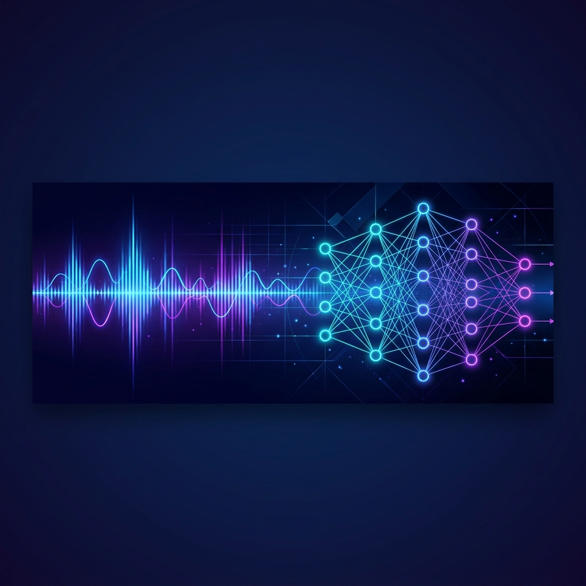

<!-- markdownlint-disable MD033 -->

  

<h1 align="center">Hi there, I'm Mykhailo Ostrovskyi (murasamadsp) 👋</h1>

  <strong>Audio DSP & Machine Learning Engineer | Sound Engineer</strong>

  
  

---

### 🎧 About Me
I'm a passion-driven Audio Digital Signal Processing (DSP) & Machine Learning Engineer, and a professional Sound Engineer based in Norway. I bridge the gap between software development, artificial intelligence, and audio engineering.

- 🛠️ **Current Focus**: Researching neural audio source separation, audio raytracing, and SaaS solutions.
- ⚡ **Interests**: Optimizing real-time DSP pipelines, neurobiology.

---

### 🛠️ Tech Stack & Tools

#### 🎛️ Audio DSP & Sound Engineering

  
  
  
  
  

#### 🧠 Machine Learning & Data Science

  
  
  
  

#### 🌐 Web Development & SaaS Architecture

  
  
  
  
  

#### 💾 Infrastructure & Databases

  
  
  
  
  

